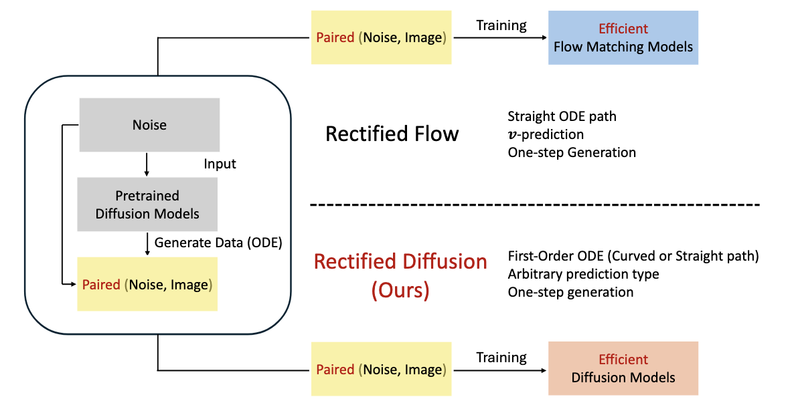
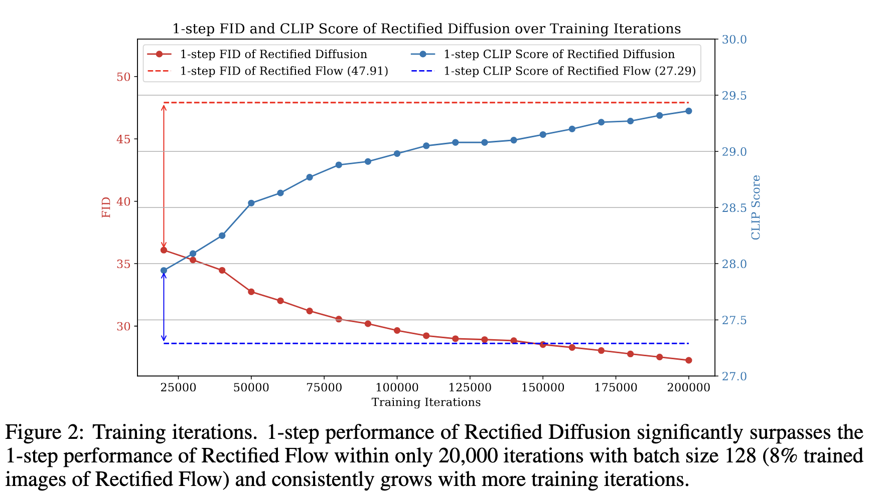

<div align="center">

## Rectified Diffusion: Straightness is Not Your Need


by *Fu-Yun Wang<sup>1</sup>, Ling Yang<sup>2</sup>, Zhaoyang Huang<sup>1</sup>, Mengdi Wang<sup>3</sup>, 
Hongsheng Li<sup>1</sup>*

<sup>1</sup>CUHK-MMLab   <sup>2</sup>Peking University   <sup>3</sup>Princeton University

[[Technical Report](https://github.com/G-U-N/Rectified-Diffusion/blob/master/report/Rectified-Diffusion-1009.pdf)]
</div>


```bibtex
@article{wang2024rectified,
  title={Rectified Diffusion},
  author={Wang, Fu-Yun and Yang, Ling and Huang, Zhaoyang and Wang, Mengdi and Li, Hongsheng},
  journal={arXiv preprint},
  year={2024}
}
```

### Introduction

**TLDR: Rectified Diffusion identifies the straighness is not the essential training target and extends the scope of rectified flow.**




**Training efficiency and efficacy:** 




### Set up

**Install environment**
```shell
conda env create -f environment.yaml
```
**Download public model weights**
```
git clone https://huggingface.co/stable-diffusion-v1-5/stable-diffusion-v1-5

git clone https://huggingface.co/stabilityai/stable-diffusion-xl-base-1.0

git clone https://huggingface.co/madebyollin/sdxl-vae-fp16-fix
```


### Evaluation
```shell
# download weights
git clone https://huggingface.co/wangfuyun/Rectified-Diffusion
# including 4 weights
- https://huggingface.co/wangfuyun/Rectified-Diffusion/resolve/main/weights/rd.ckpt
- https://huggingface.co/wangfuyun/Rectified-Diffusion/resolve/main/weights/cm.ckpt
- https://huggingface.co/wangfuyun/Rectified-Diffusion/resolve/main/weights/phased.ckpt
- https://huggingface.co/wangfuyun/Rectified-Diffusion/resolve/main/weights/phasedxl.ckpt
# you can download the weights through wget -c
wget -c https://huggingface.co/wangfuyun/Rectified-Diffusion/resolve/main/weights/rd.ckpt

# download coco-2017
wget -c http://images.cocodataset.org/zips/val2017.zip

# generate 5k pairs for evaluation 
bash gen_5k.sh

python -m pytorch_fid coco_5k results/rectifieddiffusion/5k/rd_cfg1.5_1step

python -m pytorch_fid coco_5k results/rectifieddiffusion/5k/rd_cfg1.5_2step

python -m pytorch_fid coco_5k results/rectifieddiffusion/5k/rd_cfg1.5_4step

python -m pytorch_fid coco_5k results/rectifieddiffusion/5k/rd_cfg1.5_8step

python -m pytorch_fid coco_5k results/rectifieddiffusion/5k/rd_cfg1.5_16step

python -m pytorch_fid coco_5k results/rectifieddiffusion/5k/rd_cfg1.5_25step


python -m pytorch_fid coco_5k results/cm/5k/cfg1.0_1step


python -m pytorch_fid coco_5k results/cm/5k/cfg1.0_2step


python -m pytorch_fid coco_5k results/phased/5k/cfg1.5_4step

python -m pytorch_fid coco_5k results/phasedxl/5k/cfg1.5_4step

```

**Reproduced results on FID on COCO-2017:** Lower is better.
| Configuration     |         NFE                | Reproduced | Reported |
|----------------------------|-----------|------------|----------|
| `Rectified Diffusion`            |    1         | 27.1       | 27.26    |
| `Rectified Diffusion`            |     2        | 22.96      | 22.98    |
| `Rectified Diffusion`            |      25      | 21.34      | 21.28    |
| `Rectified Diffusion (CM)`            |   1             | 22.75      | 22.83    |
| `Rectified Diffusion (CM)`            |    2            | 21.38      | 21.66    |
| `Rectified Diffusion (Phased)`            |   4        | 20.49      | 20.64    |
| `Rectified Diffusion-XL (Phased)`            |  4      | 25.59      | 25.81    |

### Train


**Train Rectified Diffusion on Stable Diffusion v1-5**
```shell


bash gen_pairs.sh # generate 1.6M noise-sample (latents) pairs pair
# Since the authors of InstaFlow does not specify the prompts used, we choose random sampled 1.6M prompts. 
# You might find the following links to be useful
# https://huggingface.co/datasets/MuhammadHanif/Laion_aesthetics_5plus_1024_33M
# https://huggingface.co/datasets/laion/laion2B-en-aesthetic

bash run.sh # train the rectified diffusion models
# I use a small batch size and small learning rate and train for more interations. The training hyper-parameters were just empirically defined instead of being carefully searched. You might find other training configurations to be better.
```


**Train Rectified Diffusion (Phased) on Stabel Diffusion v1-5**
```shell
# you should first donwload a subset of laion-2b for training. I use a 500k images for training.
bash run_phased.sh
```

**Train Rectified Diffusion (Phased) on Stabel Diffusion XL**
```shell
# you should first donwload a subset of laion-2b for training. I use a 500k images for training.
bash run_phasedxl.sh
```

### Contact

If you have any questions, please feel free to contact us: Fu-Yun Wang (fywang@link.cuhk.edu.hk) and Ling Yang (yangling0818@163.com).


### Further Reading

1. [Flow Straight and Fast: Learning to Generate and Transfer Data with Rectified Flow](https://arxiv.org/abs/2209.03003)
2. [Flow Matching for Generative Modeling](https://arxiv.org/abs/2210.02747)
3. [Scaling Rectified Flow Transformers for High-Resolution Image Synthesis](https://arxiv.org/abs/2403.03206)
4. [Improving the Training of Rectified Flows](https://arxiv.org/abs/2405.20320)
5. [PeRFlow: Piecewise Rectified Flow as Universal Plug-and-Play Accelerator](https://arxiv.org/abs/2405.07510)
